# Library Management System - Detailed UML Diagram

This diagram provides a comprehensive view of the project's architecture, including the common base classes, security infrastructure, and the core business logic for users, books, and loans.

```mermaid
classDiagram
    %% --- Common / Infrastructure ---
    namespace Common {
        class BaseEntity {
            <<abstract>>
            -Long id
            -LocalDateTime createdAt
            -LocalDateTime updatedAt
        }
        class BaseMapper~E, REQ, RES~ {
            <<interface>>
            +toEntity(REQ) E
            +toDTO(E) RES
        }
        class CrudService~REQ, RES, ID~ {
            <<interface>>
            +create(REQ) RES
            +getById(ID) RES
            +update(ID, REQ) RES
            +delete(ID)
        }
        class PageResponse~T~ {
            -List~T~ content
            -int totalPages
            -long totalElements
            -int size
            -int number
        }
    }

    %% --- Authentication & Security ---
    namespace Security {
        class SecurityConfig {
            +securityFilterChain(HttpSecurity) SecurityFilterChain
        }
        class JwtService {
            -String secretKey
            +extractUsername(String) String
            +generateToken(UserDetails) String
            +isTokenValid(String, UserDetails) boolean
        }
        class JwtFilter {
            +doFilterInternal(...)
        }
        class AuthService {
            +authenticate(AuthRequestDTO) AuthResponseDTO
            +refreshToken(HttpServletRequest, HttpServletResponse)
            +revokeAllUserTokens(User)
        }
        class Token {
            -String token
            -TokenType tokenType
            -boolean revoked
            -boolean expired
        }
    }

    %% --- User Module ---
    namespace UserModule {
        class User {
            <<abstract>>
            -String username
            -String password
            -String email
            -Role role
        }
        class Member {
            -String membershipNumber
        }
        class Librarian {
            -LibrarianPosition position
            -LocalDate employmentDate
        }
        class UserFactory {
            <<interface>>
            +createUser(UserRequestDTO) User
        }
        class UserService {
            -UserRepository userRepository
            -UserFactory userFactory
            +create(UserRequestDTO) UserResponseDTO
        }
    }

    %% --- Catalog (Book, Author, Category) ---
    namespace Catalog {
        class Book {
            -String title
            -String isbn
            -int availableCopies
            +borrow(int amount)
            +returnCopies(int amount)
        }
        class Author {
            -String fullName
            -AuthorType type
        }
        class Category {
            -String name
        }
    }

    %% --- Loan Module ---
    namespace LoanModule {
        class Loan {
            -LocalDate loanDate
            -LocalDate dueDate
            -LocalDate returnDate
            -LoanStatus status
            +returnBook()
        }
        class LoanService {
            -LoanRepository loanRepository
            -BorrowingPolicy policy
            +borrowBook(BorrowRequestDTO) BorrowResponseDTO
            +returnBook(ReturnRequestDTO) BorrowResponseDTO
        }
        class BorrowingPolicy {
            <<interface>>
            +isAllowed(int requested, int current) boolean
        }
    }

    %% --- Relationships & Inheritance ---
    
    %% Inheritance
    User --|> BaseEntity
    Book --|> BaseEntity
    Author --|> BaseEntity
    Category --|> BaseEntity
    Loan --|> BaseEntity
    
    Member --|> User
    Librarian --|> User
    
    %% Implementations
    UserFactoryImpl ..|> UserFactory
    UserService ..|> CrudService
    
    %% Associations
    User "1" *-- "*" Token : manages
    Book "*" -- "*" Author : has
    Book "*" -- "*" Category : tagged with
    
    Loan "1" --> "1" Member : borrower
    Loan "1" --> "1" Book : item
    Loan "1" --> "1" Librarian : issuedBy
    
    %% Dependencies / Service Logic
    UserService ..> UserFactory : uses
    AuthService ..> JwtService : uses
    AuthService ..> SecurityConfig : configures
    LoanService ..> BorrowingPolicy : enforces
    LoanService ..> Book : updates
```

## Architectural Breakdown

### 1. Persistence Layer (Entities)
All persistent classes inherit from `BaseEntity`, providing consistent ID and auditing fields. The system uses JPA's `JOINED` inheritance for the `User` hierarchy, allowing `Member` and `Librarian` to have specialized tables while sharing the `User` base.

### 2. Business Logic Layer (Services)
- **`UserService`**: Uses a **Factory Pattern** (`UserFactory`) to create different types of users dynamically based on their roles.
- **`LoanService`**: Orchestrates the loan lifecycle. It uses a **Strategy Pattern** (via `BorrowingPolicy`) to validate borrowing requests against library rules.

### 3. Security Layer
The security layer is built around a custom **JWT filter chain**.
- `JwtService` handles token parsing and validation.
- `AuthService` manages sessions and implements token revocation to ensure that logged-out users cannot re-use old tokens.

### 4. Common Infrastructure
- **Generics**: The project heavily uses Java Generics in `BaseMapper`, `CrudService`, and `PageResponse` to reduce boilerplate code and ensure type safety across all modules.
- **Mappers**: Each module has a dedicated mapper (e.g., `BookMapper`) that transforms Entities into DTOs, keeping the internal database structure hidden from the API consumers.
